Blockchain & Cryptocurrency Di Era Industry 4.0

Cover Buku ini sedang di desain.

Written by Gun Gun Febrianza

# Industrial Revolution

Kata **Revolution** mengacu pada pristiwa perubahan radikal secara mendadak. Revolusi karena teknologi mengubah sistem ekonomi dan struktur sosial. Kata **Industry** mengacu pada produksi barang dan jasa menggunakan teknologi dan kata **Industrialization** digunakan untuk menjelaskan perkembangan suatu industri dalam skala besar.

Akar dari proses **industrialization** adalah pesatnya **Scientific Revolution**, yaitu perkembangan ilmu pengetahuan ilmiah (**Scientific Knowledge**) dan teknologi. 

Sejarahnya awal mula revolusi industri ini terjadi di Inggris pada pertengahan abad ke 18, dari tahun 1750 sampai tahun 1850 yang didominasi oleh pengembangan **Steam Engine** dengan bahan bakar batu bara (**coal**) dan kemajuan mesin-mesin untuk industri tekstil. 

**Power** : Pemanfaatan mechanical power dari mesin uap (**Steam Engine**) dengan cara membakar batu bara (**coal**) untuk memanaskan air agar menghasilkan uap untuk tenaga mesin.

**Manufacture** : Proses manufaktur mengalami pergeseran dari karya tangan manusia (**handmade**) menggunakan mesin (**machine-made**) dan **home-made** menjadi **factory-made**.

**Transportation** : Kuda, lembu dan hewan tunggangan darat lainnya diganti dengan rel kereta api dan transportasi laut menggunakan **Steamships**. 

**Communication** : Pesan yang sebelumnya di bawa menggunakan manusia diganti menggunakan alat komunikasi instant seperti **Telegraph**.

## Social Changes

Perkembangan teknologi merubah cara orang-orang hidup dan bekerja, hingga bagaimana pemerintah mengatur dan mengendalikan. Sebelum revolusi industry, pekerja yang handal menjalankan **family business** seperti memintal benang (**Spinning Thread**) dan menenun kain (**Weaving Cloth**) di rumah. Kontrak kerja sama dilakukan dengan pedagang (**Merchant**). 

Akhir tahun 1700an industri rumahan (**Cottage Industry**) diganti oleh perusahaan-perusahaan besar. Membangun pabrik-pabrik dengan mesin-mesin yang mendisrupsi skill dan tenaga manusia. Jatuhnya skill dan tenaga manusia oleh mesin menimbulkan marjinalisasi. Munculnya sistem upah dengan bayaran berdasarkan jam, bukan lagi berdasarkan output seperti sebelumnya dimana skill dan tenaga dapat mempengaruhi nilai **output**.

Para pekerja diundang bekerja untuk mengoperasikan mesin dan upah kerja berdasarkan waktu bekerja, bukan berdasarkan output. 

Di era revolusi industri inggris saat itu kekayaan dan kekuatan politik ada di tangan orang-orang aristokrat yang mengendalikan tanah. Pada akhir tahun 1800 banyak para aristokrat posisinya di gantikan oleh para pemilik bisnis yang sangat kaya. 

Sementara di Amerika yang sebelumnya tidak pernah di isi kaum aristokrat, muncul struktur kekuasaan baru tempat munculnya para **Robber Baron**, mereka adalah orang-orang kaya seperti **Andrew Carnegie** penguasa baja, **John D Rockefeller** penguasa minyak, dan **J.P Morgan** penguasa perbankan. Mereka membangun kompetisi yang sangat ketat dan memanipulasi harga agar bisa mendapatkan keuntungan yang sangat besar. 

Budaya Korporasi (**Corporation**) mulai terbangun, diawali para **Entrepreneur** yang secara individual membeli mesin dan mengundang pekerja untuk bekerja sama dengan mereka. Lalu sekumpulan **Entrepreneur** bergabung dalam satu organisasi untuk bisa membeli mesin yang lebih mahal dan membangun pabrik. Inilah awal korporasi di era revolusi industri.

Kombinasi Revolusi Pertanian (**Agriculture Revolution**) dan Revolusi Industri (**Industrial Revolution**) membuat masyarakat berpindah untuk hidup dikota. Suksesnya membangun produktivitas pertanian membuat kuatnya sektor ketahanan pangan (**Food Security**). Jaminan ketersediaan makanan dan kemudahan akses pada makanan membuat masyarakat bisa fokus membangun peradaban selanjutnya.

Populasi manusia tumbuh dengan drastis di setiap kota yang mengalami industrialisasi. 

## Political Changes

Berpindahnya masyarakat ke kota dan bangkitnya pabrik pabrik sebagai sumber kekayaan mereduksi kekuatan dan pengaruh para aristokrat lama, termasuk raja dan ratu yang telah menguasai di abad pertengahan (**Middle Age**). Awalnya pemilik pabrik memiliki suara besar dalam memberikan pengaruh pada urusan-urusan pemerintahan, namun pada pertengahan tahun 1800 suara dipilih atas nama hak-hak pekerja.

Perdebatan moral terkait etika pemilik pabrik terhadap pekerja menjadi isu menarik. Seperti pertanyaan apakah pemilik pabrik dapat berlaku semena-mena kepada pegawainya? Perebutan pengaruh dan suara antara pemilik pabrik dan serikat pekerja terus berlanjut. Sehingga demokrasi modern yang kita kenal saat ini memiliki akar kuat berasal dari perubahan sosial hasil dari revolusi industri. 

# Industry 4.0

**Industry 4.0** adalah industri yang sudah melakukan digitalisasi pada proses manufakturnya, tujuannya untuk meminimalisir manusia dan intervensi secara manual. Revolusi Industri ke 4 membawa mesin-mesin untuk manufaktur menjadi lebih cerdas dan bisa saling terhubung. 

Industry 4.0 menggunakan mesin dan robot, bedanya dengan mesin dan robot pada industri sebelumnya adalah pada industry 4.0 robot memiliki kecerdasan sendiri, otonomi sendiri dan dapat terhubung dengan mesin-mesin cerdas lainnya dalam kelas yang sama.

Pada **Smart Factory**, robot tidak memerlukan lagi intervensi manusia untuk membuat keputusan yang sangat presisi. Semua ini dapat diwujudkan karena ada teknologi **Artificial Intelligence** dan **Sensor**. Dari preventive **maintenance** menuju **predictive maintenance**, robot dapat memahami kapan robot harus segera di **maintenance**.

## Smart Factory

### Shrimp Industry

Pada Industri tambak udang salah satu mesin cerdas yang secara general dapat memahami molecule dan element di dalam air secara realtime, selanjutnya secara general mesin cerdas memiliki kemampuan predictive analytic dan menentukan keputusan.

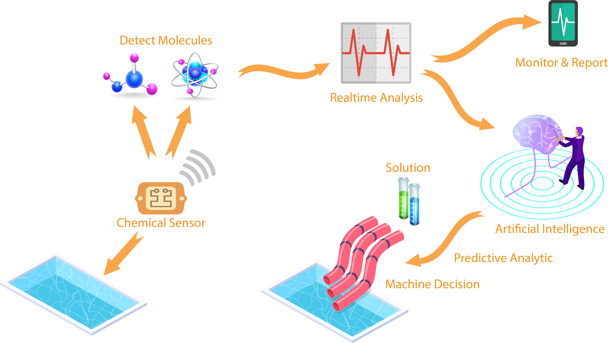

### Warehouse Industry

Pada Warehouse Industry, Bionic Hive mengeluarkan produk bernama SQUID untuk otomasi pekerjaan digudang. Jika robot ini ingin diterapkan tantangannya adalah upgrade infrastruktur. Box, rack dan infrastruktur yang sama harus digunakan agar SQUID bisa menyesuaikan diri. Robot memiliki otonominya sendiri untuk menentukan keputusan.

### Transportation

Pada dunia transportasi Nanyang Technology University dan perusahaan swedish VOLVO membangun autonomous bus bertenaga listrik pertama di dunia. Bus dapat mengangkut 80 orang dan mampu melakukan perjalanan sepanjang 25 kilometer dalam kondisi full-charge. Penerapan teknologi fast charging membuat bus ini membutuhkan waktu sekitar 6 menit saja untuk full charge.

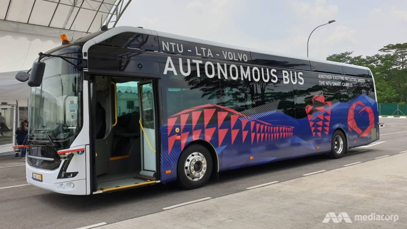

## Economy & Industrial Revolution

Untuk memahami Revolusi Industri kita harus sedikit mengupas kajian ekonomi. Dalam Ekonomi terdapat aktivitas ekonomi seperti **production**, sebuah area berbagai industri memproduksi barang dan jasa sesuai identitas mereka. 

Jika kita perhatikan berdasarkan sejarahnya, setiap kali terjadi revolusi industri terdapat perubahan **magnitude** pada aktivitas ekonomi dan karakteristik ekonomi. 

Kecepatan pada aktivitas ekonomi tumbuh secara eksponensial, skala aktivitas ekonomi membesar membuat skup **breadth and depth** baru, dan kualitas memberikan sistem impak pada suatu negara, perusahaan, industri dan masyarakatnya.

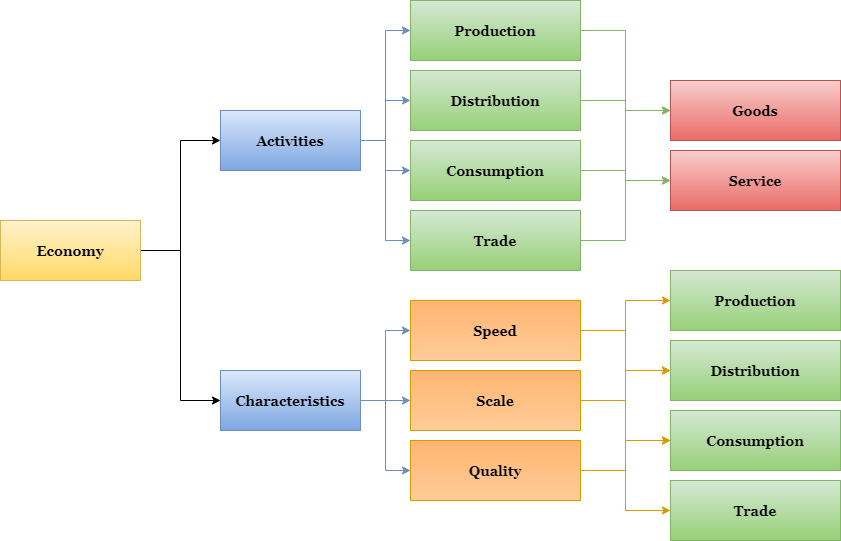

Sebuah laporan yang disusun oleh **Boston Consultancy Group (BCG)** memprediksi bahwa revolusi industri terbaru akan meningkatkan kecepatan kapasitas production sampai 30% dan 25% lebih efisien, peluang investasi disektor manufaktur mencapai **approximately** 250 Milyar Euro [1].

## History

### First Industrial Revolution

Jika kita lihat lagi kedalam sejarah **trigger** Revolusi Industri Pertama adalah penemuan mesin bertenaga uap (**Steam Engine**) rentang waktunya dimulai dari pertengahan abad ke 18. Revolusi Industri pertama kali terjadi di Inggris Raya (**Great Britain**), **production** menggunakan tangan manusia akhirnya diganti oleh mesin. Ada kejutan peningkatan **production**. 

Pembangunan Rel Kereta Api (**Railroads**) dan ekstraksi batu bara besar-besaran menjadi momentum pertumbuhan ekonomi. 

### Second Industrial Revolution

Pada Revolusi industri kedua proses industrialisasi mulai menonjol di negara Inggris Raya (**Great Britain**), Jerman, Amerika, Francis, Italy dan Jepang. Revolusi industri kedua dihiasi dengan berbagai penemuan seperti telepon, telegram, kendaraan mesin diesel, pesawat terbang, 

Revolusi industri kedua ditandai dengan penggunaan listrik dan produksi masal. **Production** terus mengalami peningkatan dari sebelumnya. 

### Third Industrial Revolution

Pada revolusi industri ketiga ditandai dengan penggunakan perangkat elektronik untuk mengurangi pekerja. Penggunaan **PLC** (**Programmer Logic Controller**) sebuah komputer digital yang dapat diprogram dan didesain memiliki ketahanan baik dilingkungan yang ekstrim sehingga cocok untuk **manufacturing** di berbagai **industry**.

Revolusi ketiga ini sering kali disebut dengan **Digital Revolution** dengan ciri perkembangan **Semiconductor**, **Mainframe Computing**, **Personal Computing** dan **Internet**. 

**Production** mengalami peningkatan tajam dari sebelumnya. 

### Fourth Industrial Revolution

Dibandingkan ketiga revolusi industri sebelumnya, Revolusi Industri 4.0 dideklarasikan secara eksplisit pada tahun 2011 pada acara **Hannover Fair** di Jerman. Faktor pendorong revolusi industry 4.0 adalah **internet** dan mesin robot yang cerdas, pada industry 4.0 robot yang memiliki otonominya sendiri.

Dan dalam sekup yang lebih luas **Industry 4.0** bukan hanya mesin-mesin robot cerdas dan smart factory saja, terdapat hal lainnya yang menjadi integral part industry 4.0  :

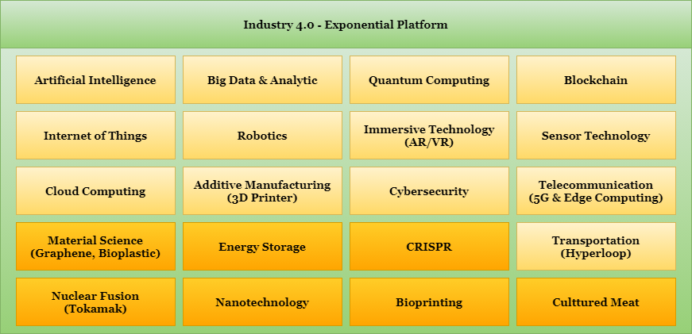

Negara Amerika Serikat merespon gagasan Jerman dengan membangun Advanced Manufacturing Partnership (AMP), China membangun **Strategic Plan** yang disebut dengan **Made In China 2025** yang berfokus untuk melakukan upgrade manufacturing system agar bisa memproduksi kualitas yang lebih baik.

Secara pemetaan **blockchain** dalam **industry 4.0** terletak di :

# Blockchain

**Blockchain** adalah sekumpulan konsep untuk membangun sistem penyimpanan data yang terdistribusi secara transparan dan resisten terhadap manipulasi. Resisten terhadap manipulasi artinya terdapat **Tamper Evidence**, sedikit saja perubahan pada data manipulasi data dapat dibuktikan.

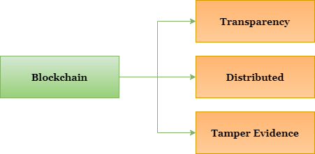

**Blockchain** adalah sebuah tempat yang digunakan untuk menyimpan data dalam bentuk rantai **block**. Setiap ***block\*** menyimpan sekumpulan data, pada kasus ini data transaksi. Setiap ***block\*** memiliki identitas unik dan saling terhubung satu sama lain melalui identitas tersebut membentuk suatu rantai (**Chain**).

**Genesis Block** adalah **block** yang pertama kali dibuat, jika terdapat perubahan pada **transaction** di dalam **block** maka identitas **block** tersebut akan berubah sehingga terputus dari rantai identitas. Disanalah tamper **evidence** dapat diketahui.

Data ini harus di distribusikan, untuk memahami akar pemikirannya kita harus kembali lagi membuka sejarah membahas **Distributed Database** dan **Distributed Ledger**.

## Blockchain History

Blockhain adalah salah satu substansi dari konsep **Distributed Ledger Technology** (**DLT**), konsep ini sudah ada sejak lama sebelum **blockchain** dan **bitcoin** ramai. Konsep ini bermula dari penelitian yang dilakukan oleh Leslie Lamport tahun 1982 [2] melalui gagasanya yang terkemuka dalam dunia **Distributed System** yaitu **Byzantine General Problem (BGP)**.

Bagaimana sistem komputer dapat memecahkan masalah terkait konflik informasi di lingkungan jaringan komputer yang tidak dapat dipercaya (**Adversarial Environment**).  

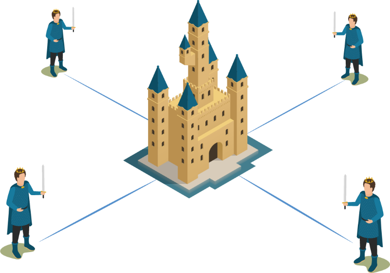

### Distributed Database 

Pada ***distributed database\*** terdapat sekumpulan ***nodes\*** yang saling mempercayai satu sama lain. Setiap ***nodes\*** dikendalikan oleh sebuah entitas tunggal bisa perorangan atau organisasi, entitas tersebut memiliki kontrol penuh atas jaringan komputer dan ***sharing\*** informasi dengan user.

Sebagai contoh, sekumpulan ***nodes\*** secara langsung dapat melakukan ***replication\*** terkait data terbaru yang diterima. ***Replication\*** adalah proses menyalin sebuah ***database\*** yang diberikan untuk setiap ***nodes\*** agar data konsisten redundan.

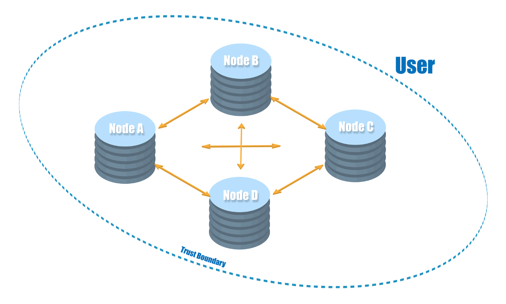

### Distributed Ledger

Perbedaannya dengan ***Distributed Database\***, pada ***Distributed Ledger\*** sekumpulan ***nodes\*** berada dalam lingkungan ***adversarial environment\*** sebuah lingkungan yang tidak dapat dipercaya mempercayai satu sama lain. 

Namun setiap ***nodes\*** dapat bekerja sama untuk memanajemen ***consensus\*** terkait eksistensi, status dan perubahan dari sekumpulan fakta yang yang dibagikan (***shared fact\***).

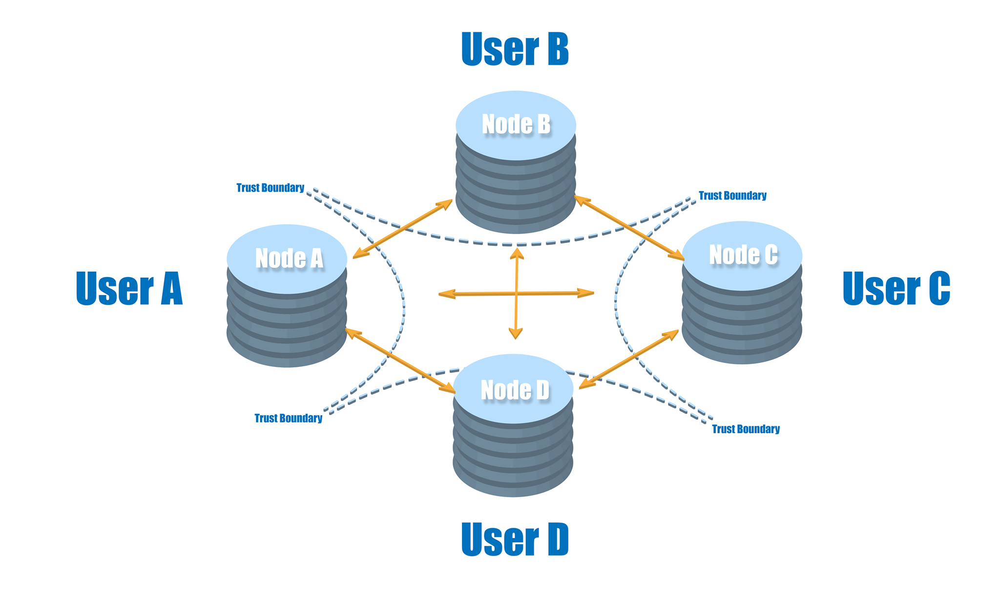

### Early Blockchain Research

Penggagas pertama untuk menghubungkan sekumpulan ***block\*** menggunakan ***cryptographic hash\*** adalah Stuart Haber dan W. Scott Stornetta. Penelitian mereka telah hadir 17 tahun sebelum konsep ***blockchain\*** dalam paper bitcoin menjadi mahsyur.

Stornetta adalah seorang fisikawan yang bekerja di perusahaan Xerox, ia pernah menjadi saksi dari skandal atas kasus manipulasi pada publikasi ternama yang dilakukan oleh seorang ahli biologi. 

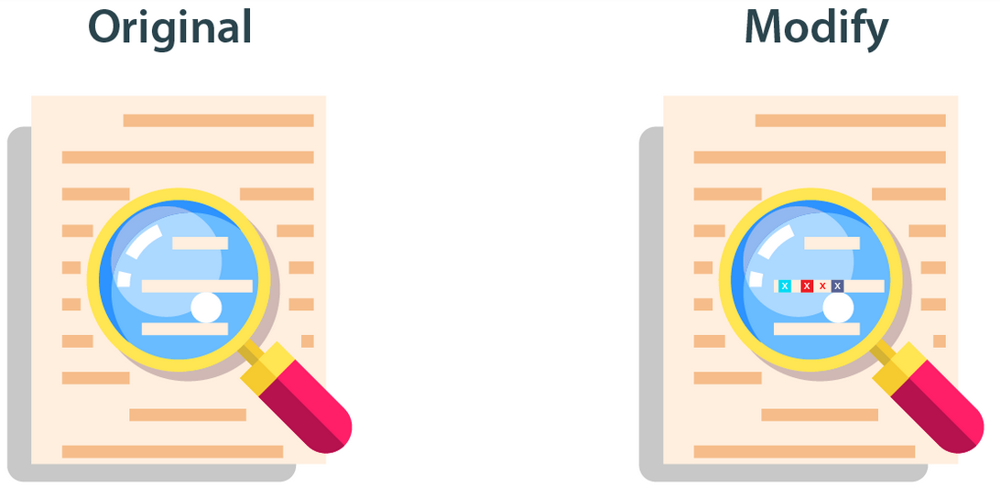

Ia berhasil membuktikan terdapat perbedaan dua tinta dalam sebuah buku catatan yang menandai adanya manipulasi. Permasalahan ini membuatnya terinspirasi jikalau kelak seluruh catatan yang dikonversi menjadi dokumen digital juga harus dapat diamankan. 

Minatnya dalam pengamanan dokumen digital terwujud setelah bertemu dengan Stuart Haber seorang ahli ***cryptography\***. Stornetta meyakinkan Haber bahwa penelitian untuk membuat rekaman catatan digital yang tidak dapat dimanipulasi sangat bernilai.

Pada tahun 1991 Haber dan Sonetta [2], membuat penelitian berjudul **How to Time-Stamp a Digital Document**. Mereka memperkenalkan sebuah notasi sekumpulan data ***block\*** yang saling terhubung satu sama lain menggunakan ***Cryptographic Hash\***. 

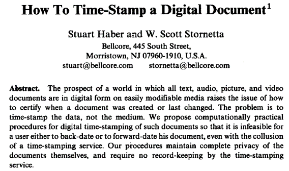

## Blockchain Abstraction

Untuk memahami **Blockchain** kita harus memahami abstraksinya, secara abstraksi kita dapat melihat **blockchain** sebagai : 

1. **Blockchain As Data Structure**
2. **Blockchain As Shared Ledger**
3. **Blockchain As Immutable Ledger**

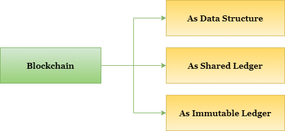

### Blockchain As Data Structure

***Data structure\*** adalah cara untuk mengorganisir sekumpulan data agar bisa digunakan secara efisien dan mampu memecahkan masalah dalam pemrograman. Pada ***blockchain\*** data tersusun ke dalam 3 level :

1. Record Level

2. Block Level

3. Block Chain Level

Secara visual dapat kita lihat pada gambar di bawah ini :

### Blockchain As Shared Ledger 

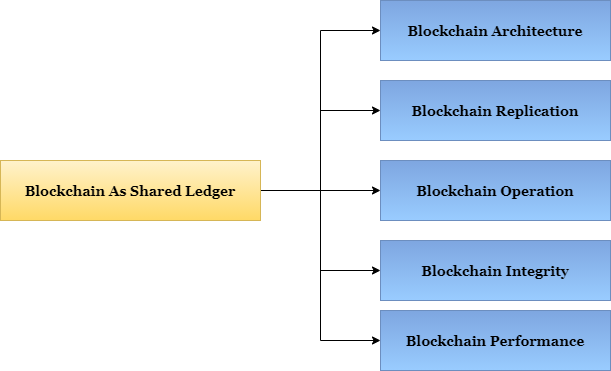

#### Blockchain Architecture 

***Blockchain\*** sebagai ***shared ladger\*** artinya kita tidak akan menggunakan sistem penyimpanan ***data ledger\*** yang terpusat atau tersentral. Sehingga tidak terdapat otoritas tunggal yang dapat mengendalikan jaringan komputer dan memanipulasi data ***ledger\***.

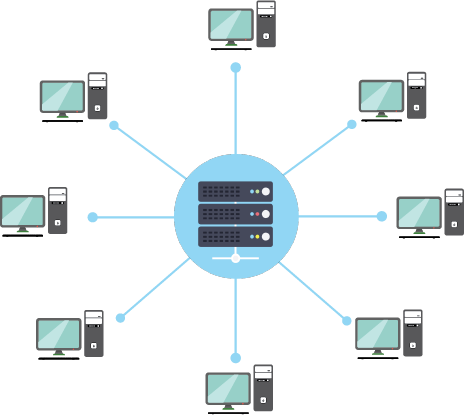

***Data ledger\*** harus disebarkan kepada semua entitas (***nodes\***) tanpa melalui perantara untuk membangun sistem ***data ledger\*** yang transparan.

#### Blockchain Replication 

***Blockchain\*** sebagai ***shared ledger\*** artinya jaringan komputer ***Peer-to-peer (P2P)\*** digunakan untuk mendistribusikan ***data ledger\*** ke semua ***node\*** di dalam jaringan komputer. 

Setiap ***node\*** tidak saling mengenal satu sama lain namun mendapatkan perlakuan dan salinan ***data ledger\*** yang sama. Setiap ***nodes\*** dalam jaringan ***Peer-to-peer (P2P)\*** mendapatkan seluruh salinan penuh ***block chain\*** yang sama, ***valid\*** dan terbaru.

#### Blockchain Operation 

Sifat ***immutable\*** pada ***blockchain\*** operasi yang dapat kita lakukan adalah ***CR\*** (***Create & Read\***). Berbeda dengan sistem ***database\*** tersentral yang dapat memanipulasi secara penuh, seperti melakukan operasi ***CRUD\*** (***Create, Read, Update & Delete\***)

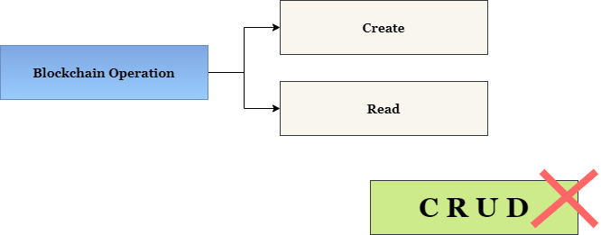

#### Blockchain Integrity 

Pada sistem ***database\*** tersentral sosok antagonis dapat mengubah data secara langsung karena data berada terpusat di satu titik. Pada ***blockchain\*** data tersebar keseluruh node sehingga untuk memanipulasi ***data ledger\*** relatif sulit karena, ***51% node\*** dalam jaringan komputer harus dikuasai. 

Seringkali hal ini menjadi mustahil dilakukan karena total ***node\*** yang berada dalam jaringan komputer jumlahnya sangat banyak dan terus tumbuh. Sehingga ***cost\*** untuk menguasai 51% ***node\*** dalam jaringan komputer ***P2P\*** menjadi tidak ***feasible\***. 

#### Blockchain Performance

Untuk menyimpan data ke dalam ***ledger\*** yang selanjutnya terdistribusi secara aktual ke seluruh ***node\*** memerlukan waktu. Diperlukan metode konsensus dan verifikasi agar data ledger konsisten diseluruh ***node\***.

Pertanyaan selanjutnya bagaimana cara untuk membuat data ledger konsisten secara aktual diseluruh partisipan yang berada dalam jaringan komputer ***peer-to-peer (P2P)\*** ?

Untuk itu kita perlu memahami ***Blockchain As Immutable Ledger\***.

### Blockchain As Immutable Ledger

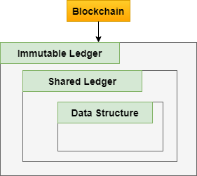

Untuk memastikan ***data ledger\*** konsisten secara aktual pada seluruh ***node\*** diperlukan sebuah ***consensus mechanism\*** atau ***consensus algorithm\***. Untuk menentukan ***block\*** transaksi yang ***valid\*** dan status terbaru ***blockchain\*** saat ini diperlukan ***consensus achievement\***. ***Block\*** transaksi yang ***valid\*** dan status terbaru ***blockchain\*** saat ini harus dapat diterima oleh semua ***node\***.

***Consensus achievement\*** diperlukan karena setiap ***node\*** di dalam jaringan komputer ***peer-to-peer (P2P)\*** masing-masing memiliki data ***blockchain\*** lokal yang harus di ***update\***, untuk menambah data terbaru. Istilah ***public blockchain\*** mengacu kepada seluruh data ***blockchain\*** yang ada pada setiap ***node\***. 

Jadi bagaimana cara untuk membuat setiap ***node\*** dalam jaringan komputer ***peer-to-peer (P2P)\*** memiliki keputusan yang sama, baik itu keputusan dalam menerima ***block\*** transaksi terbaru atau menolak ***block\*** transaksi terbaru?

Dalam matematika dan sains komputer permasalahan Ini adalah problema klasik yang dikenal dengan ***Byzantine General Problem\*** (***BGP\***). Bagaimana membuat setiap ***node\*** dalam jaringan komputer ***peer-to-peer\*** (***P2P\***) memiliki keputusan yang sama, meskipun salah satu ***node\*** mengalami kegagalan fungsi atau bertindak jahat?

#### Byzantine General Problem (BGP) 

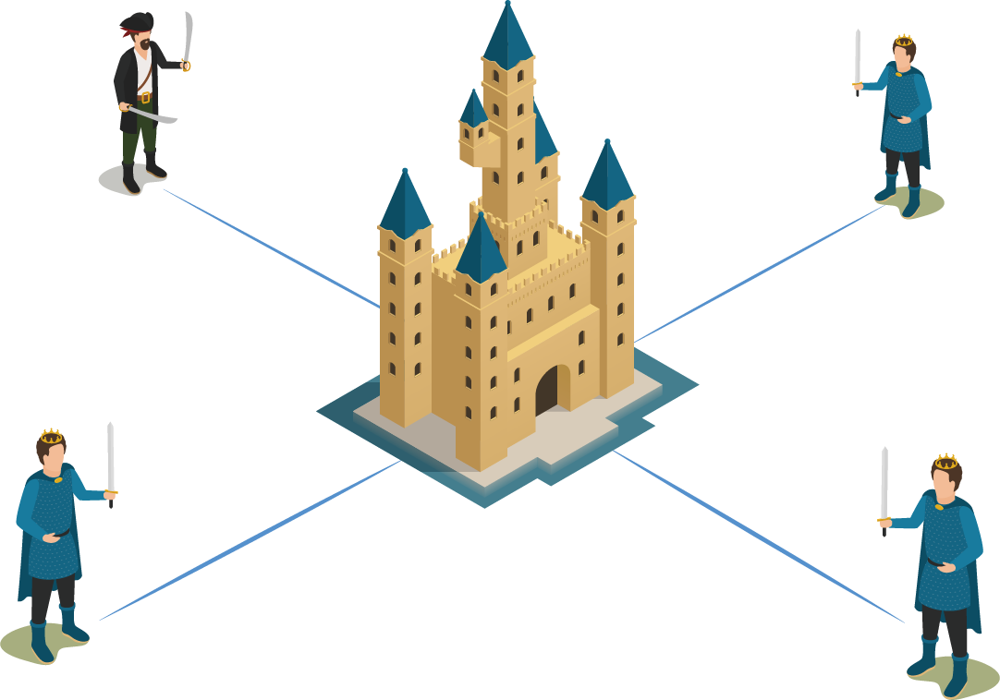

Setiap jendral dan pasukannya masing-masing berada dilokasi yang terpisah untuk mengepung kota yang hendak diserang. Setiap jendral harus menentukan langkah apa yang akan diambil menyerang atau mundur.

Keputusan yang serempak dan sama, lebih penting dari menyerang atau mundur tanpa koordinasi yang serempak.

Setiap jendral memiliki permasalahan komunikasi sebab pesan yang dikirim melalui kurir dalam perjalanan dapat diperlambat, dihancurkan atau bahkan hilang. Selain itu meskipun pesan berakhir sampai satu atau lebih dari satu jendral bisa saja bertindak jahat dan mengirimkan pesan palsu untuk membingungkan jendral lainnya sehingga mengakibatkan kegagalan total dalam peperangan.

Jika diterapkan kedalam ***blockchain\*** setiap jendral di representasikan sebagai sebuah ***node\*** dan ***node\*** perlu mencapai konsensus untuk menentukan keputusan yang sama secara serempak. 

Untuk mencapai konsensus 2/3 atau lebih ***node\*** yang jujur harus menguasai jaringan komputer ***peer-to-peer\*** (***P2P\***).

Inilah yang menjadi faktor utama kenapa ***blockchain\*** as ***immutable\*** ***ledger\*** masih memiliki celah dari serangan ***51% Attack\***, diamana ***51% node\*** yang tidak jujur menguasai jaringan ***peer-to-peer\*** (***P2P\***).

#### Byzantine Fault-tolerance (BFT) 

***Byzantine Fault Tolerance\*** adalah karakteristik sebuah sistem yang tetap berjalan meskipun terdapat kegagalan yang berasal dari ***Byzantine General Problem\***. Sebuah sistem yang sudah memiliki karakteristik ***Byzantine Fault Tolerance\*** dapat terus berjalan meskipun terdapat ***node\*** yang mengalami kegagalan fungsi atau bertindak jahat.

Ada berbagai algoritma konsensus untuk membangun sistem ***blockchain\*** yang memiliki karakteristik ***byzantine fault tolerance\***. 

Implementasi algoritma konsensus yang paling terkenal saat ini adalah ***Proof of Work\*** (***PoW\***), selain itu juga terdapat algoritma konsensus lainya seperti ***Proof of Stake\*** (***PoS\***). Konsep ***PoW\*** sendiri sudah diciptakan lebih lama sebelum ***blockchain\*** hadir.

#### Proof of Work (PoW)

Pada Protokol ***Bitcoin\*** Algoritma ***Proof of Work (PoW)\*** tidak sepenuhnya mencapai ***byzantine fault tolerance\***, pembuatnya ***Satoshi Nakamoto\*** memodifikasi algoritma menjadi lebih canggih dengan cara memanfaatkan konsep ***mining\*** dan ***cryptography\***. 

Hal ini membuat ***Proof of Work\*** (***PoW\***) telah terbukti sebagai salah satu algoritma konsensus yang dapat diandalkan dan aman untuk mengamankan ***blockchain\***. 

## Blockchain Conclusion

Dari runutan penjelasan sebelumnya kita dapat melihat kompleksitas ***blockchain\*** mulai dari hal yang terkecil sampai ke hal yang terbesar dalam konsep ***blockchain\*** itu sendiri.

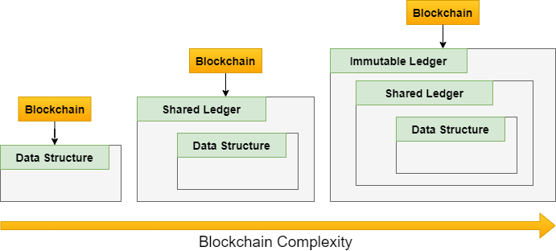

Pada ***blockchain\*** sebagai ***data structure\*** kita dapat menggunakannya untuk mencatat transaksi, sebagai ***shared ledger\*** kita dapat mendistribusikannya untuk membangun transparansi dan sebagai ***immutable ledger\*** kita dapat memastikan bahwa ***blockchain\*** harus resisten terhadap manipulasi. 

### Blockchain Application

Jika dilihat menggunakan kaca mata PEST Framework aplikasi blockchain bukan hanya untuk teknologi keuangan saja namun bisa digunakan untuk inovasi lainnya, seperti membangun bursa efek saham yang mampu melakukan T+0 Settlement :

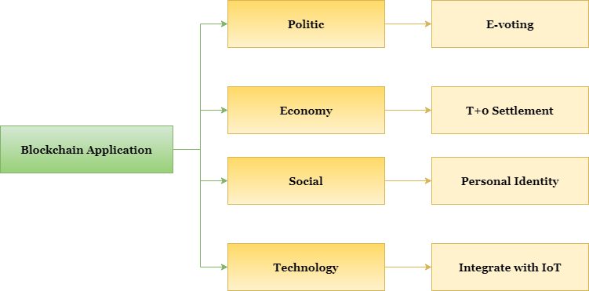

Next 3-5 years? to T+0 Settlement?

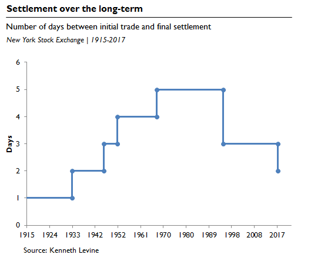

# Cryptocurrency

**Cryptocurrency** adalah salah satu aplikasi **blockchain** yang paling sukses dan fenomenal. Aplikasi dari blockchain untuk sektor industri keuangan dan produk **cryptocurrency** yang paling sukses adalah **Bitcoin**. Eksistensinya kini menjadi **alternative financial channel** terbaru.

Di bawah ini adalah gambar dari laporan berjudul **The Future of Financial Services** dari **World Economic Forum (WEF)**. Kita bisa melihat bagaimana tim dari WEF melakukan pemetaan **Cryptocurrency** pada kategori **payments**.

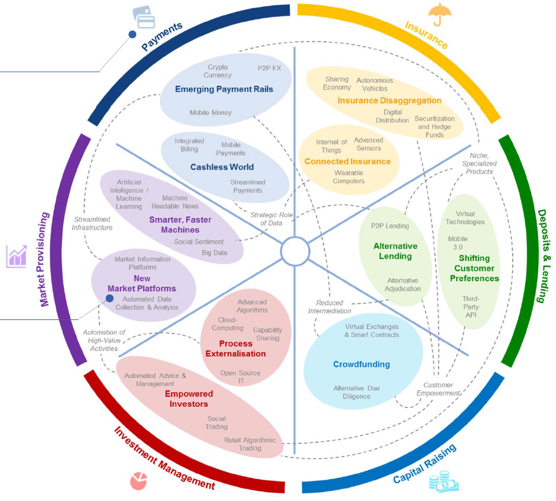

**Cryptocurrency** adalah mata uang digital yang menggunakan cryptography untuk meregulasi produksi jumlah mata uangnya dan memverifikasi transfer dana yang dioperasikan secara independen tanpa melalui bank sentral. 

**Cryptocurrency tidak bisa dipalsukan dan kebal terhadap manipulasi. Keunikan dari Cryptocurrency adalah produksinya tidak diatur oleh satu pihak atau tersentral****. Cryptocurrency** **adalah mata uang digital yang tidak bisa dikontrol dan dikendalikan oleh pemerintah atau entitas apapun dalam hal produksi mata uangnya.** 

**Cryptocurrency menggunakan teknologi blockchain dan cryptography, transaksi menggunakan Cryptocurrency akan diverifikasi dan diamankan menggunakan algoritma cryptography kedalam sebuah buku besar (digital ledger) yang disebut dengan** **Blockchain****.** 

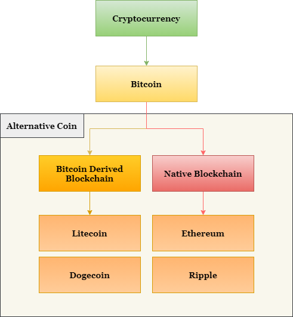

## Cryptography

***Cryptography\*** adalah ilmu untuk membuat pesan rahasia. *Cryptography* adalah salah satu cabang ilmu *cryptology* dalam sains komputer. ***Cryptology\*** adalah study ilmiah untuk melindungi informasi dan membongkar informasi rahasia. Di dalam *cryptology* terdapat cabang ilmu **Cryptoanalysis**, sebuah ilmu atau analisis untuk membongkar pesan rahasia. 

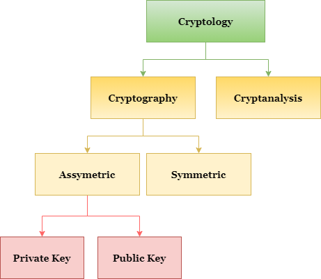

### Public Key Cryptography

***Public Key Cryptography\*** atau sering disebut ***Assymetric Cryptography\*** pertama kali dipublikasikan oleh **Whitfield Diffie**, **Martin Hellman** dan **Ralph Merkle** pada tahun 1976.

Modern Cryptography sudah menggunakan formula matematika yang rumit untuk melakukan enkripsi (*encrypt*) dan dekripsi (*decrypt*) pada suatu data dengan menggunakan kunci pasangan yang sama.

*Program* yang menggunakan *Assymetric Cryptography* untuk memproduksi *Public Key & Private Key* disebut dengan ***Key Generation Program\***.

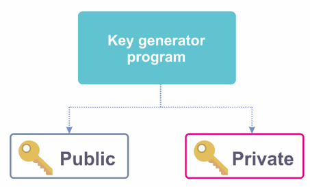

#### Public Key

**Public key** adalah kunci yang bisa diberikan kepada seluruh pihak yang tertarik untuk berkomunikasi.

#### Private Key

**Private Key** adalah kunci rahasia yang harus dijaga rahasia oleh pembuatnya.

### Digital Signature

Salah satu permasalahan klasik dalam dunia ***cryptography\*** adalah pengamanan dokumen digital. Bagaimana suatu entitas dapat mengirim dokumen ke entitas lainnya dengan jaminan dan bukti bahwa dokumen adalah asli, tidak akan dimanipulasi. 

Sebab saat dokumen dikirim melalui ***channel\*** yang tidak aman (***insecure channel\***), dalam perjalanan dokumen dapat dimodifikasi oleh entitas antagonis. Sehingga penerima mendapatkan dokumen digital yang tidak asli alias telah dimodifikasi.

Sebagai contoh, Maudy memiliki ***document\*** yang akan dikirim untuk Gun. Untuk memastikan Gun mendapatkan dokumen digital yang asli, Maudy bisa menggunakan tanda tangan digital (***Digital Signature\***).

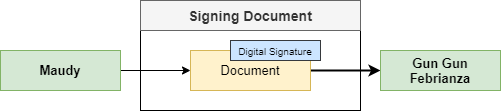

Dokumen digital diberi tanda tangan digital oleh Maudy agar ketika dokumen sampai kepada Gun, proses verifikasi dapat dilakukan oleh Gun untuk memastikan bahwa dokumen asli dan tidak dimodifikasi.

***Digital Signature\*** mengandalkan konsep ***public\*** & ***private key\***, untuk menandatangani sebuah ***document\*** Maudy dan Gun memerlukan ***software cryptography\*** yang memiliki fitur ***key generation program\*** untuk memproduksi ***public\*** & ***private key\***. 

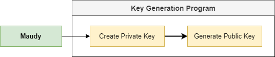

Proses untuk menandatangani sebuah dokumen membutuhkan ***private key\***, selanjutnya untuk memverifikasi tanda tangan digital diperlukan ***public key\***. Jika dokumen dapat diverifikasi menggunakan ***public key\*** maka dapat dinilai bahwa dokumen otentik.

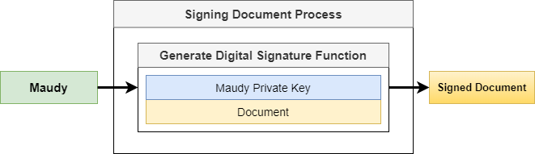

Maudy menandatangani dokumen menggunakan ***private key\***, kemudian mengirimkan ***signed document\*** dan salinan ***public key\*** kepada Gun.

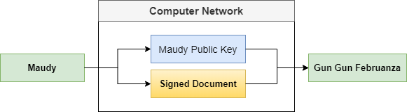

Pada gambar di bawah ini Gun menggunakan ***Public Key\*** milik maudy untuk memastikan bahwa dokumen yang ia terima adalah asli (***authentic\***). 

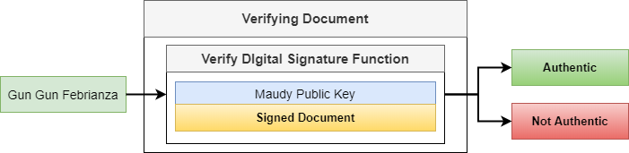

#### Message Tampering

Jika verifikasi dokumen hasilnya **Not Authentic** maka dokumen telah dimodifikasi sehingga **authentication** gagal. Gun Gun Febrianza dapat mengetahui bahwa dokumen yang dia dapatkan adalah palsu. Sebab perubahan satu karakter saja dalam dokumen akan terdeteksi.

#### Cryptocurrency Application

Penerapan ***public key cryptography\*** bukan hanya untuk mengamankan pesan seperti dokumen, tetapi juga dapat digunakan untuk mengamankan transaksi finansial. 

Sebagai contoh Maudy Ayunda dan Gun Gun Febrianza dapat menggunakan pesan yang telah diberi ***digital signature\***, untuk melakukan transfer kepemilikan sebuah aset digital sebagai bentuk pembayaran.

Maudy Ayunda perlu meminta ***public key\*** milik Gun Gun Febrianza terlebih dahulu. 

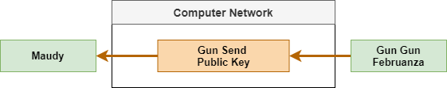

Selanjutnya maudy membuat draft pesan bahwa Gun Gun Febrianza adalah pemilik baru dari sebuah aset digital sebesar 200 ***Digital Dolar\*** dan menandatanganinya menggunakan ***private key\*** miliknya.

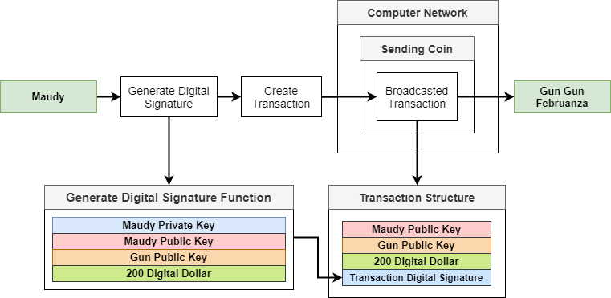

Jika dikemudian hari Gun Gun Febrianza menggunakan uang yang di dapat untuk diberikan kepada Nikolaj Vestorp sebesar 100 ***Digital Dollar\***. Maka Gun harus meminta ***public key\*** milik nikolaj terlebih dahulu.

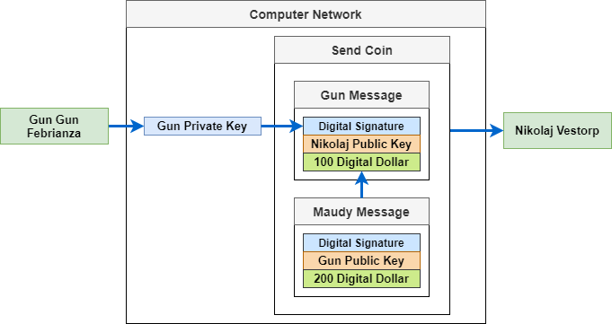

Gun membuat ***draft\*** pesan bahwa Nikolaj Vestorp adalah pemilik baru dari sebuah aset digital sebesar 100 ***Digital Dolar\*** dan menandatanganinya menggunakan ***private key\*** miliknya.

### Elliptic Curve Cryptography

Untuk memproduksi sepasang kunci ***public\*** & ***private key\***, Protokol ***Bitcoin\*** menggunakan ***Elliptic Curve Digital Signature Algorithms\*** (***ECDSA\***). 

Karakteristik yang dimiliki dalam ***ECDSA\*** sangat cocok untuk transaksi dalam ***Bitcoin\***, sebab beberapa algoritma hanya dapat memproduksi ***public & private key\*** sekaligus dalam satu waktu. 

Pada algoritma ***ECDSA\***, ***public key\*** hanya dapat diproduksi dari ***private key\*** kapanpun. 

### Cryptographic Hashing

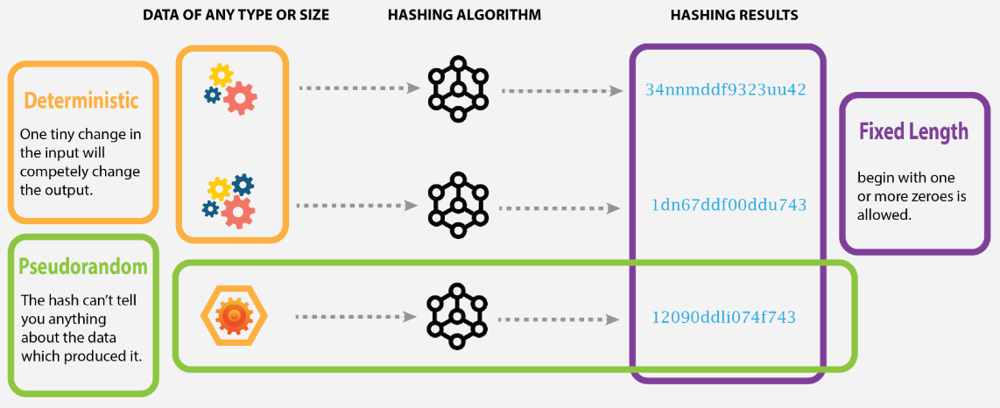

***Hash Function\*** adalah sebuah algoritma yang dapat mengubah *input* dengan *arbitrary length* tertentu ke dalam *output* yang memiliki ukuran *fixed* (misal 128 [*bit*](#_Bit)). Sebagai contoh pada hash algorithm SHA256 kita dapat memproduksi 40 karakter unik untuk setiap *arbitrary input length*.

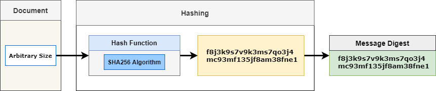

***Hashing\*** adalah proses yang terjadi saat *hash function* mengolah *input* untuk memproduksi *message digest* atau *hash value*. ***Hashing\*** digunakan untuk menyembunyikan data dengan mengubahnya kedalam *message digest*.

*Hash Function* memiliki beberapa *properties* di antaranya adalah ***Determinism\*** yaitu *input* yang sama akan selalu menghasilkan *output* yang sama. *Output* dari sebuah *hash* memiliki karakteristik ***Pseudorandom\***, pesan aslinya hampir mustahil untuk diketahui.

#### Message Digest

*Output* dari *hash function* disebut dengan *hash value* atau sering juga disebut dengan *message digest*. *Message Digest* dapat digunakan untuk memverifikasi [*integrity*](#_Integrity) suatu data, sehingga jika dokumen sebelumnya diubah kita dapat mengetahuinya.

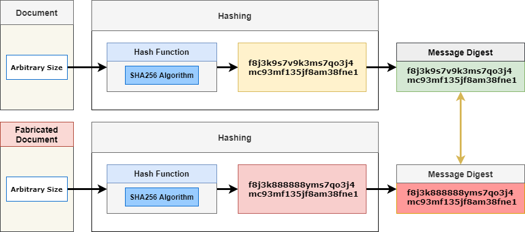

Untuk mengetahui bahwa dokumen telah diubah, jika kita bandingkan kembali nilai **message digest** pada dokumen original dan dokumen yang telah diubah maka akan memiliki perbedaan.

Pada Protokol **Bitcoin**, penerapan **digital signature** yang dibuat menggunakan **private-key** dari pengguna **bitcoin** digunakan dalam **Bitcoin Transaction** dan juga digunakan untuk memverifikasi bahwa transaksi memang dilakukan oleh pemilik **private key**.

**Bitcoin Address** yang digunakan untuk mengirim **bitcoins** dibuat menggunakan berbagai algoritma **hashing**. **Digital Signature** dan **Bitcoin Address** tersimpan di dalam **Bitcoin Transaction**. Jika **Digital Signature** benar maka **transfer bitcoins** dapat dikonfirmasi oleh jaringan komputer **Bitcoin**.

Banyak sekali fungsi internal dalam Protokol Bitcoin sangat tergantung pada **Cryptographic Hash**, setiap **transaction** akan di **hashing** dan **message digest** akan dijadikan sebagai **digital signature** untuk memastikan tidak terdapat perubahan semenjak pertama kali transaction dibuat oleh pengirim.

**Block** yang terdiri dari sekumpulan **transaction** juga akan di **hashing** untuk memastikan tidak terdapat perubahan pada daftar transaksi di dalam **block**.

#### Collision Resistance

Secara komputasi *hash function* tidak boleh menghasilkan *output hash value* yang sama dari dua *input* yang berbeda.

# Money

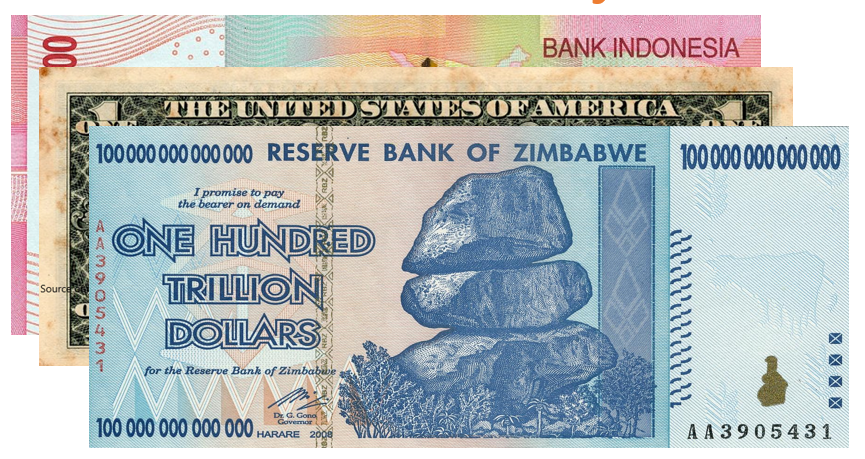

Apa itu Uang ? 

Untuk masyarakat yang ada di generasi saat ini pasti membayangkan uang koin & uang kertas yang ada di dalam dompet kita atau uang digital yang ada di dalam bank atau akun Gopay yang kita miliki. 

Semakin maju peradaban manusia, konsep tentang uang terus berkembang menjadi semakin kompleks, perhatikan pada gambar ini bagaimana uang terus berevolusi :

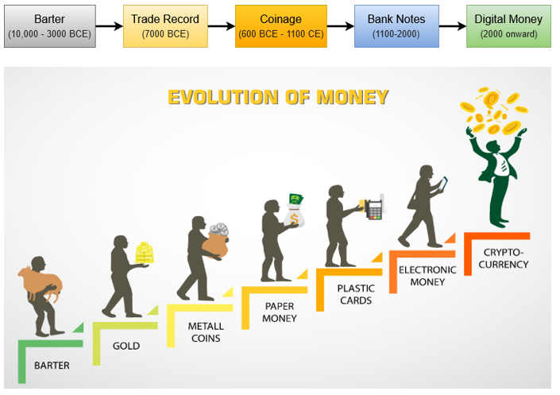

Jika kita kembali ke masa lalu, uang yang kita miliki saat ini berbeda dengan uang yang dimiliki oleh orang-orang terdahulu. 

Zaman dahulu gandum, sapi atau perak dapat digunakan sebagai uang melalui barter. Gandum, sapi dan perak menjadi bernilai karena sumbernya terbatas atau langka (***scarce\***). Apakah saat ini kita tetap bisa melakukan barter? Jikalau bisa, kenapa bisa? 

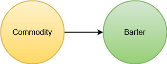

Karena pada dasarnya uang adalah segala sesuatu yang dapat digunakan sebagai alat pembayaran (***medium of exchange\***).

*Money is defined by people and what they do.*

*When people use something as a medium of exchange, it becomes money.*

Uang seringkali di definisikan melalui fungsinya yaitu :

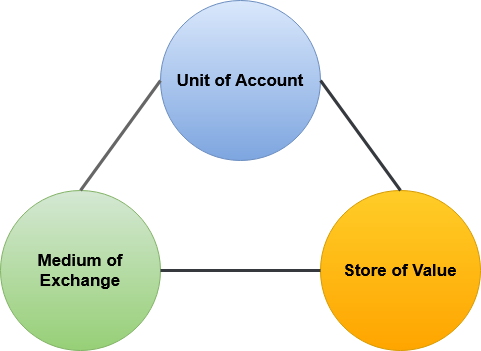

## Money Properties

### Medium of Exchange

Makna dari ***medium of exchange\*** adalah uang harus dapat digunakan sebagai alat pembayaran yang dapat diterima secara universal. Untuk memahaminya lebih dalam kita harus memahami sejarah barter yang pernah terjadi dimasa lampau.

Zaman dahulu saat era barter pembeli yang ingin membeli suatu, harus mengetahui terlebih dahulu barang apa yang diinginkan oleh si penjual agar dapat melakukan barter. Jika tidak mengetahui maka barter akan gagal.

Permasalahan ini mendorong inovasi tentang konsep uang yang harus dapat diterima secara universal oleh pembeli dan penjual barang.

### Unit of Account

Makna dari ***unit of account\*** adalah uang harus dapat digunakan untuk mengukur nilai dari suatu barang dan jasa agar dapat dibeli atau dijual. 

### Store of Value

Makna dari ***store of value\*** adalah uang harus dapat digunakan untuk menyimpan sebuah nilai. Nilai yang tersimpan harus dapat digunakan di masa yang akan datang. Uang harus ‘**siap digunakan’** jika kita ingin memanfaatkannya untuk membeli suatu barang dan jasa.

## Type of Money

Setelah mempelajari konsep ***medium of exchange\*** anda mulai memahami bahwa uang dapat memiliki wujud yang berbeda-beda. Sehingga jika dikategorikan terdapat dua macam uang yaitu uang yang memiliki nilai ***intrinsic\*** dan uang yang tidak memiliki nilai ***intrinsic\***.

### Intrinsic Value

Nilai ***intrinsic\*** adalah nilai asli yang melekat pada suatu medium. Sebagai contoh emas, kita dapat menerima emas (***gold\***) sebagai uang yang memiliki nilai ***intrinsic\***, karena emas memiliki berbagai kualitas yang dapat diandalkan (***reliable\***). 

Emas memiliki karakteristik yang jumlahnya terbatas (***scarce\***) dan salah satu elemen yang tidak mengalami korosif (***durable\***). 

Emas termasuk dalam kategori ***Commodity Money\***, emas juga dapat digunakan sebagai perhiasan (***jewelry\***) sehingga emas memiliki nilai tambah baru karena dapat diubah menjadi perhiasan.

Nilai ***instrinsic\*** dapat bersifat subjektif, bagaimana suatu nilai harus didefinisikan karena setiap manusia memiliki kesadaran yang berbeda-beda? 

Terdapat teori yang disebut dengan ***Labor Theory of Value (LTV)\***, teori ini menjelaskan bahwa nilai dari suatu barang ditentukan dari seberapa besar tenaga kerja dan modal yang dibutuhkan untuk menciptakan suatu barang. 

Semakin banyak tenaga kerja dan modal yang dibutuhkan untuk memproduksi barang maka barang tersebut akan semakin bernilai. Namun, pada tahun 1871 seorang ekonomis dari austria bernama Carl Menger memperkenalkan gagasan tentang ***Subjective Value\***. 

Gagasan ***subjective value\*** menjelaskan bahwa nilai dari suatu barang ditentukan oleh faktor kebutuhan (***needs\***) dan keinginan (***wants\***) manusia. Nilai bersifat independen dari faktor poduksi (***production\***).

Sebagai contoh berlian 100 karat yang ditemukan di balik semak semak memiliki nilai yang sama dengan berlian yang harus didapatkan dengan cara menggali tambang puluhan kilometer. 

### Commodity Money

Emas adalah salah satu bentuk dan varian uang yang ada di Amerika pada abad ke 19. Saat itu ada cerita menarik terkait emas yaitu ketika ditemukannya pegunungan emas di California dan kemudian di Alaska yang menyebabkan kuantitas emas pada sirkulasi emas yang ada melonjak.

Beberapa fenomena inflasi terburuk yang pernah di hadapi amerika disebabkan karena jumlah emas yang beredar terus meningkat selama abad ke 19. Saat itu emas ***adalah commodity money\*** yang tidak bisa diproduksi karena sudah tersedia di planet bumi sejak awal.

Selain emas juga terdapat bentuk uang dan varian uang lainnya yang terdapat di Amerika saat itu, yaitu tembakau. Tembakau telah menjadi commodity money di bagian selatan Amerika

### Fiat Money

Uang yang diterbitkan pemerintah secara legal (***fiat money\***) bagaikan bahan bakar yang membuat mesin terus berputar. Uang mempermudah usaha kita untuk mengukur nilai dari suatu barang dan jasa. Uang memfasilitasi milyaran transaksi yang terjadi setiap harinya.

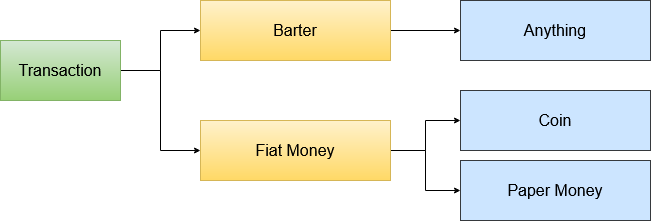

Seringkali ketika saya berdiskusi tentang uang, mendapatkan pertanyaan seperti ini :

Kenapa kita tidak kembali bertransaksi menggunakan emas?

Tanpa uang fiat kita tidak memiliki pilihan selain melakukan barter menggunakan barang dan jasa setiap harinya. Barter dapat dilakukan untuk menangani transaksi yang sederhana namun pada skala yang lebih besar kegiatan transaksi menjadi tidak efisien dan memakan waktu.

Dari latar belakang di atas tujuan penciptaan uang untuk mempercepat transaksi yang efektif dan efisien dalam membangun ekonomi. Aktifitas perputaran produksi, distribusi, konsumsi dan perdagangan menjadi lebih cepat.

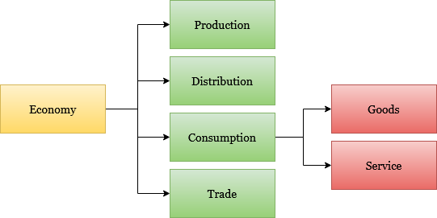

Masyarakat menggunakan ***valuable object\*** atau benda-benda yang dianggap bernilai dan layak untuk barter. Ribuan tahun lalu manusia melakukan barter menggunakan gandum, sapi, kerang, emas dan permata.

Ada beberapa kekurangan jika kita melakukan barter, 

### Trading Problem

Sebagai contoh pada petani pisang jika mereka ingin melakukan barter antara pisang dan *strawberry*, petani pisang harus memastikan terlebih dahulu bahwa petani *strawberry* juga menginginkan pisang dan juga sebaliknya. 

Jika salah satunya tidak saling membutuhkan misalkan petani *strawberry* menolak untuk ditukar dengan pisang maka akan menimbulkan ***trading problem\***  :

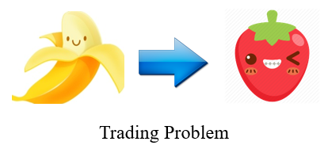

Pada kasus *trading problem* di atas kita memahami bahwa tidak semua orang membutuhkan pisang atau *strawberry*. Artinya perbedaan barang mempengaruhi faktor untuk bertransaksi. Sehingga di perlukan suatu medium untuk bertransaksi yang dapat diterima secara universal.

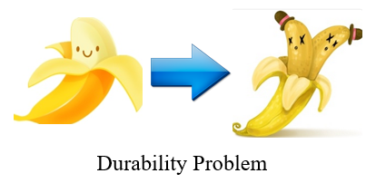

Selain itu transaksi menggunakan pisang memiliki permasalahan ***durability problem\***, pisang dapat membusuk sehingga tidak digunakan lagi untuk melakukan barter. Sehingga diperlukan suatu medium untuk bertransaksi yang memiliki ketahanan untuk menyimpan nilai.

Jika kita adalah petani pisang maka kita menginginkan :

1. Suatu medium untuk bertransaksi yang dapat diterima secara universal.
2. Suatu medium untuk bertransaksi yang memiliki ketahanan untuk menyimpan nilai.

## Money Production

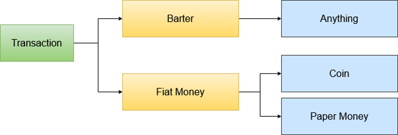

### Money Production By Yourself

Jika komoditas dapat dijadikan sebagai uang, maka kita bisa membangun asset yang bisa memproduksi berbagai komoditas. Example Tambak Udang, Usaha Sayur, Etc. Kita memiliki kendali penuh atas diri kita untuk bisa membangun asset yang dapat memproduksi komoditas sebanyak-banyaknya.

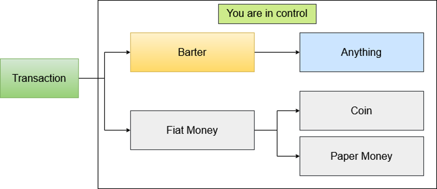

### Money Production By Government

Pemerintah dan Bank Central Bertanggung jawab untuk mengatur kebijakan moneter, misal agar tidak terjadi inflasi yang berlebihan.

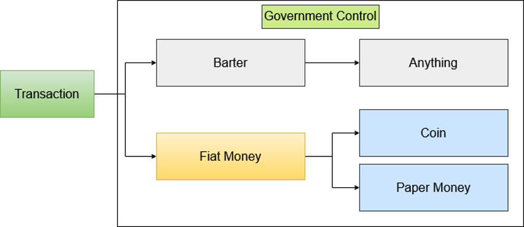

### New Way Production of Money

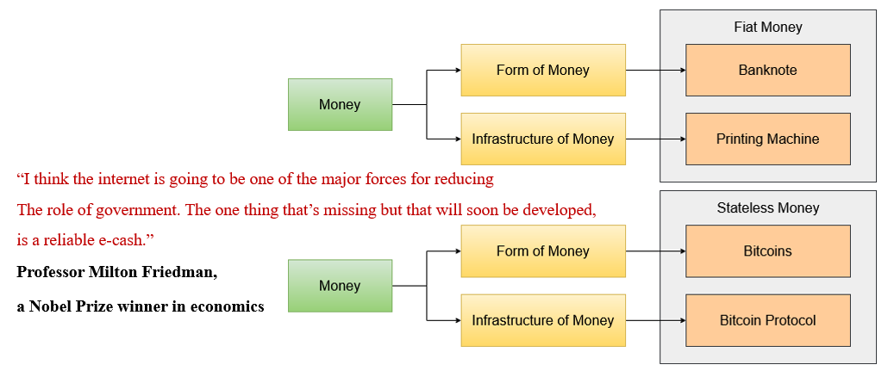

### Critical Thinking

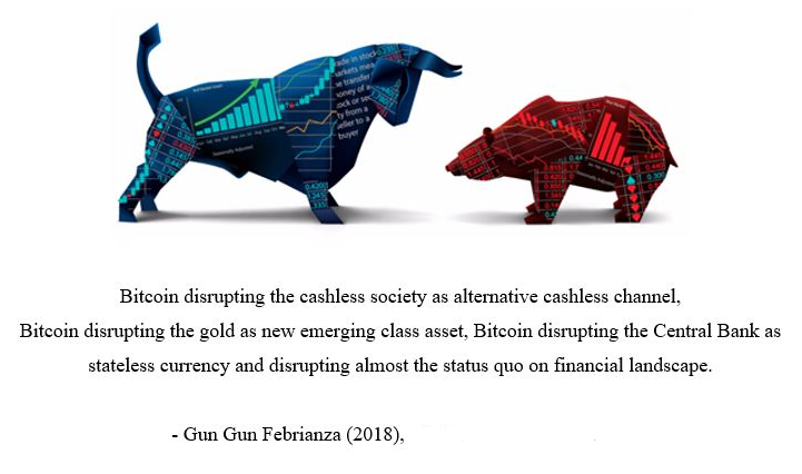

### Private Virtual Currency

## Future Money

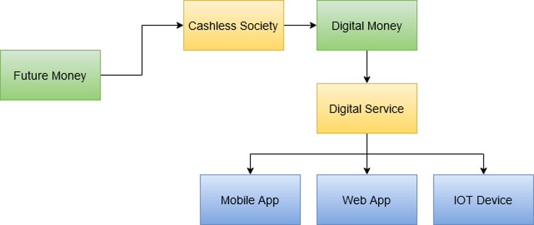

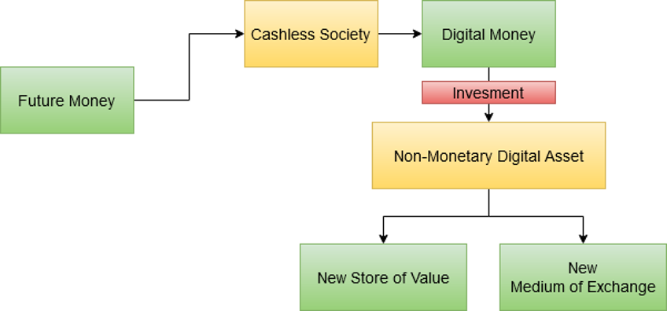

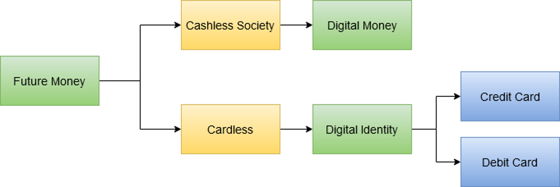

## Cashless Challenge

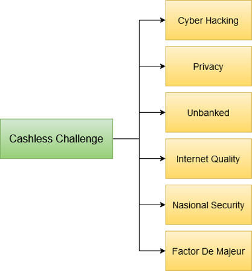

Driver for cashless

1. Government
   1. Control Money Supply & Monetary Policy
   2. Monitoring Tax
   3. Reduce Corruption
   4. Combat Terorrism Financing
2. Global Payment Technology Company
   1. Visa 
   2. Mastercard
3. Fintech Startup
   1. Gopay
   2. OVO

# Bitcoin Protocol

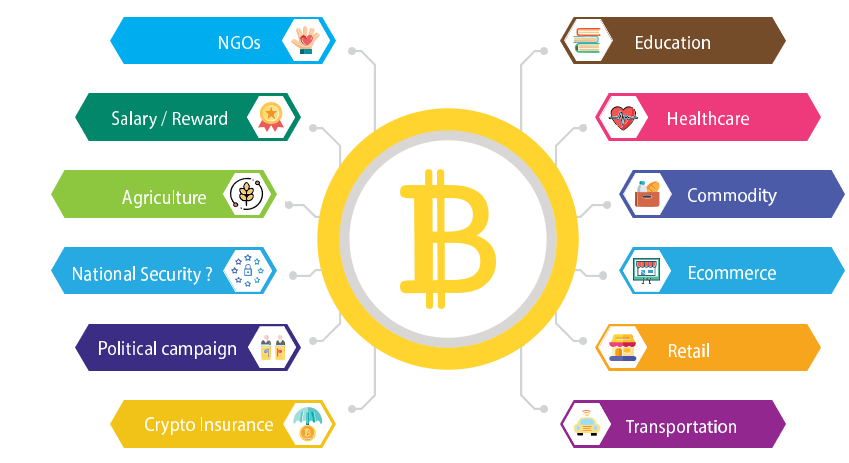

***Bitcoin\*** adalah sekumpulan konsep dan teknologi yang digunakan untuk membentuk sebuah ekosistem uang digital (*Digital Money*) [3]

***bitcoins\*** adalah mata uang digital yang dapat digunakan untuk bertransaksi tanpa memerlukan bank. ***Bitcoin\*** memberikan disrupsi kepada bank sentral dalam memonopoli produksi uang di abad ini. 

## Bitcoin & bitcoins

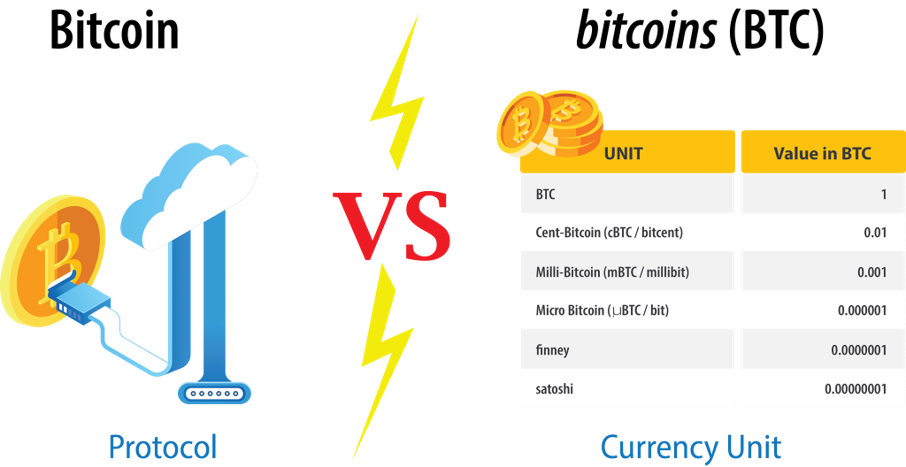

***Bitcoin\*** & ***bitcoins\*** itu tidak sama. ***Bitcoin\*** dengan ‘B’ kapital mengacu kepada Sistem atau Protokol ***Bitcoin\*** dan ***bitcoins\*** adalah unit mata uangnya yang berbasis ***virtual\***. Mata uang ***bitcoins\*** berbeda dengan mata uang fiat yang secara legal dicetak oleh pemerintah.

## Bitcoin Transaction

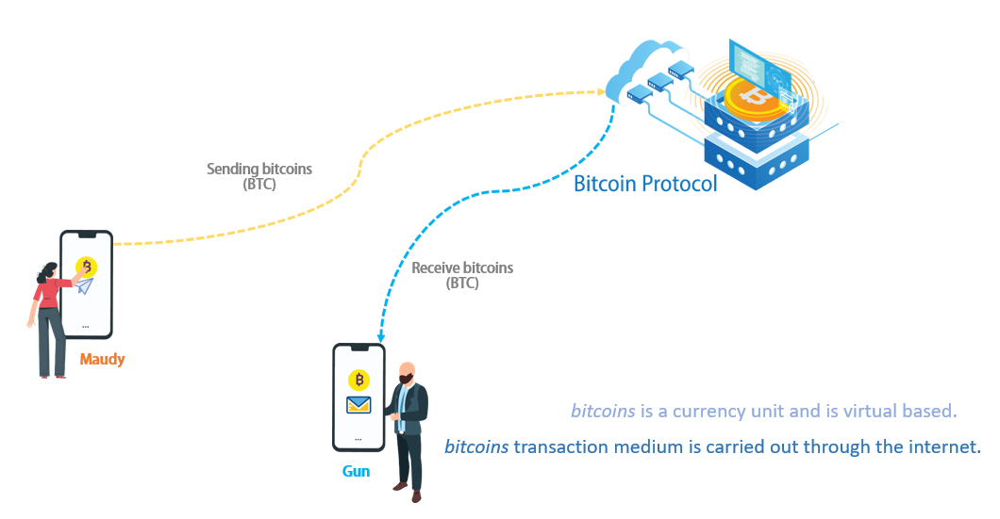

## Limitless Transaction

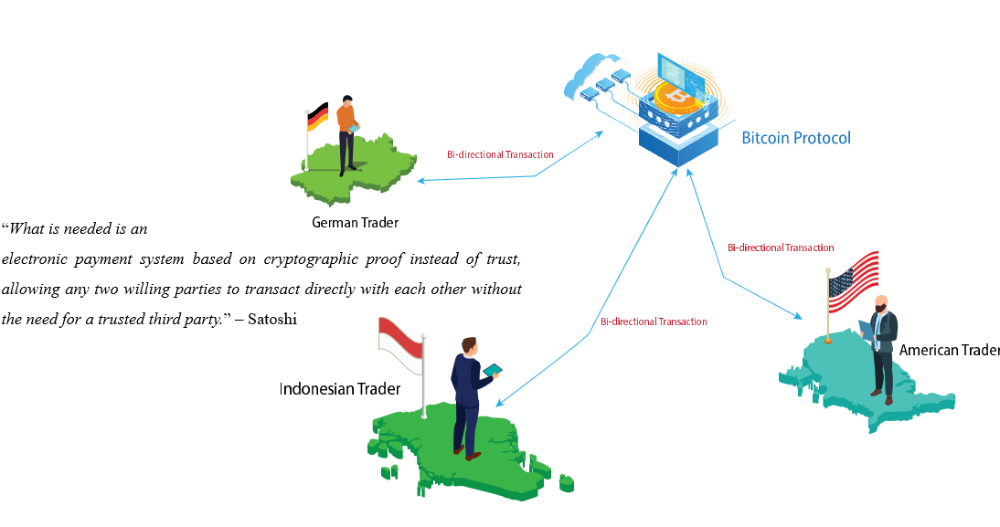

# Notes

[1] Rüssmann M, Lorenz M, Gerbert P,WaldnerM, Justus J, Engel P, HarnischM(2015) Industry 4.0: the future of productivity and growth in manufacturing industries. Boston Consulting Group Publication

[2] Lamport, L., Shostak, R. & Pease, R., "The Byzantine Generals Problem," *ACM Transactions on Programming Languages and Systems.,* vol. 4, p. 387–389, 1982. 

[3] A. M.  Antonopoulos, Mastering Bitcoin - Programming the Open Blockchain, O'reilly,  2017. 

Copyright PT Virtual Koin Indonesia