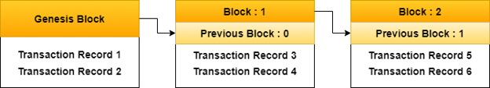

# Blockchain & Cryptocurrency Di Era Industry 4.0

Written by Gun Gun Febrianza

# Industrial Revolution

Kata **Revolution** mengacu pada pristiwa perubahan radikal secara mendadak. Revolusi karena teknologi mengubah sistem ekonomi dan struktur sosial. Kata **Industry** mengacu pada produksi barang dan jasa menggunakan teknologi dan kata **Industrialization** digunakan untuk menjelaskan perkembangan suatu industri dalam skala besar.

Akar dari proses **industrialization** adalah pesatnya **Scientific Revolution**, yaitu perkembangan ilmu pengetahuan ilmiah (**Scientific Knowledge**) dan teknologi. 

Sejarahnya awal mula revolusi industri ini terjadi di Inggris pada pertengahan abad ke 18, dari tahun 1750 sampai tahun 1850 yang didominasi oleh pengembangan **Steam Engine** dengan bahan bakar batu bara (**coal**) dan kemajuan mesin-mesin untuk industri tekstil. 

**Power** : Pemanfaatan mechanical power dari mesin uap (**Steam Engine**) dengan cara membakar batu bara (**coal**) untuk memanaskan air agar menghasilkan uap untuk tenaga mesin.

**Manufacture** : Proses manufaktur mengalami pergeseran dari karya tangan manusia (**handmade**) menggunakan mesin (**machine-made**) dan **home-made** menjadi **factory-made**.

**Transportation** : Kuda, lembu dan hewan tunggangan darat lainnya diganti dengan rel kereta api dan transportasi laut menggunakan **Steamships**. 

**Communication** : Pesan yang sebelumnya di bawa menggunakan manusia diganti menggunakan alat komunikasi instant seperti **Telegraph**.

## Social Changes

Perkembangan teknologi merubah cara orang-orang hidup dan bekerja, hingga bagaimana pemerintah mengatur dan mengendalikan. Sebelum revolusi industry, pekerja yang handal menjalankan **family business** seperti memintal benang (**Spinning Thread**) dan menenun kain (**Weaving Cloth**) di rumah. Kontrak kerja sama dilakukan dengan pedagang (**Merchant**). 

Akhir tahun 1700an industri rumahan (**Cottage Industry**) diganti oleh perusahaan-perusahaan besar. Membangun pabrik-pabrik dengan mesin-mesin yang mendisrupsi skill dan tenaga manusia. Jatuhnya skill dan tenaga manusia oleh mesin menimbulkan marjinalisasi. Munculnya sistem upah dengan bayaran berdasarkan jam, bukan lagi berdasarkan output seperti sebelumnya dimana skill dan tenaga dapat mempengaruhi nilai **output**.

Para pekerja diundang bekerja untuk mengoperasikan mesin dan upah kerja berdasarkan waktu bekerja, bukan berdasarkan output. 

Di era revolusi industri inggris saat itu kekayaan dan kekuatan politik ada di tangan orang-orang aristokrat yang mengendalikan tanah. Pada akhir tahun 1800 banyak para aristokrat posisinya di gantikan oleh para pemilik bisnis yang sangat kaya. 

Sementara di Amerika yang sebelumnya tidak pernah di isi kaum aristokrat, muncul struktur kekuasaan baru tempat munculnya para **Robber Baron**, mereka adalah orang-orang kaya seperti **Andrew Carnegie** penguasa baja, **John D Rockefeller** penguasa minyak, dan **J.P Morgan** penguasa perbankan. Mereka membangun kompetisi yang sangat ketat dan memanipulasi harga agar bisa mendapatkan keuntungan yang sangat besar. 

Budaya Korporasi (**Corporation**) mulai terbangun, diawali para **Entrepreneur** yang secara individual membeli mesin dan mengundang pekerja untuk bekerja sama dengan mereka. Lalu sekumpulan **Entrepreneur** bergabung dalam satu organisasi untuk bisa membeli mesin yang lebih mahal dan membangun pabrik. Inilah awal korporasi di era revolusi industri.

Kombinasi Revolusi Pertanian (**Agriculture Revolution**) dan Revolusi Industri (**Industrial Revolution**) membuat masyarakat berpindah untuk hidup dikota. Suksesnya membangun produktivitas pertanian membuat kuatnya sektor ketahanan pangan (**Food Security**). Jaminan ketersediaan makanan dan kemudahan akses pada makanan membuat masyarakat bisa fokus membangun peradaban selanjutnya.

Populasi manusia tumbuh dengan drastis di setiap kota yang mengalami industrialisasi. 

## Political Changes

Berpindahnya masyarakat ke kota dan bangkitnya pabrik pabrik sebagai sumber kekayaan mereduksi kekuatan dan pengaruh para aristokrat lama, termasuk raja dan ratu yang telah menguasai di abad pertengahan (**Middle Age**). Awalnya pemilik pabrik memiliki suara besar dalam memberikan pengaruh pada urusan-urusan pemerintahan, namun pada pertengahan tahun 1800 suara dipilih atas nama hak-hak pekerja.

Perdebatan moral terkait etika pemilik pabrik terhadap pekerja menjadi isu menarik. Seperti pertanyaan apakah pemilik pabrik dapat berlaku semena-mena kepada pegawainya? Perebutan pengaruh dan suara antara pemilik pabrik dan serikat pekerja terus berlanjut. Sehingga demokrasi modern yang kita kenal saat ini memiliki akar kuat berasal dari perubahan sosial hasil dari revolusi industri. 

# Origin of Industrial Revolution

Terminologi **Revolution** mulai popular pada akhir tahun 1800an diperkenalkan oleh seorang **British Sociologist** bernama **Arnold Toynbee**. Revolusi Industri terjadi secara bertahap ratusan tahun di eropa ditandai dengan tergantinya **Medieval Period** atau abad pertengahan (**Middle Ages**) dengan era modern (500-1400).

## The Reinassance

The Reinassance dimulai pada tahun 1400 di eropa barat yang mengalami perubahan besar, seringkali disebut dengan abad kebangkitan ilmu pengetahuan. Sebelum itu, setelah jatuhnya **Roman Empire** pada tahun 476, hampir selama seribu tahun agama menjadi pusat anutan seluruh aspek kehidupan.

Runtuhnya **Roman Empire** sebagai pusat kekuatan membuat gereja katolik bisa menjadi institusi yang paling dominan di eropa barat untuk mempelajari subjek lainnya selain agama seperti politik dan sains, namun critical thinking untuk menandingi agama masih jauh. Penjelasan terkait setiap kejadian alam (**Natural Occurences**) secara general bersifat agamis, menurut gereja sebuah kejadian terjadi itu semua karena kehendak Tuhan.

Seorang pejuang bisa menjadi seorang pangeran atau raja dengan syarat harus mendapatkan berkah (**Blessing**) terlebih dahulu dari gereja (**Church**). Hal ini membuat struktur sosial dan politik di eropa berevolusi menjadi **Feodalism**, para pejuang bersenjata yang menjadi aristokrat pertama dapat beraktivitas politik dengan berkah (**Blessing**) dari gereja.

Sebagian besar petani yang tidak memiliki tanah, mereka bekerja di tanah milik seorang aristokrat. Mereka tidak memiliki properti dan hak hukum, mereka harus tunduk pada aturan untuk berkerja dengan aristokrat sebagai tuan pemilik tanah (landlord) bagi mereka. 

Sampai tahun 1400 praktek pendidikan agama daeri gereja katolik seperti ini selama hampir seribu tahun lamanya tidak banyak dipertanyakan dan dipertentangkan.

Revolusi Industri kedua terjadi antara tahun 1850 sampai tahun 1940 yang secara dominan terjadi dibenua amerika dan eropa. Di dominasi oleh pengembangan **Internal Combustion Engine** dan Listrik (**Electricity**).

**Industrial Revolution** menjelaskan pristiwa pada periode tahun 1770s sampai pertengahan tahun 1870s, sebuah masa dimana tenaga manusia akhirnya diganti oleh teknologi berbasis listrik dan mekanik. Hasilnya adalah perubahan **manufacturing** dan metode **production**, kultur bekerja dan lahirnya model transportasi dan infrastruktur terbaru untuk masyarakat.

The Revolution begin : Steam Engines, Railroads, Steamboats

New Machines & The Factory System

Social & Political Impact 

# Science & Technology

Terminologi **Science** dan **Scientist** pertama kali dipopulerkan oleh **William Whewel** diantara tahun 1830 sampai tahun 1840an. Terminologi **Technology** diklaim berawal dari buku karya tulis **Jacob Bigelow's** yang berjudul **Elements of Technology** (1829). Sebelum abad ke 19 terminologi dari **natural philosophy** disebut dengan **science** dan terminologi **mechanical**, **practical** dan **art** dianggap sebagai **technology**.

Terminologi **Engineering** dan **Engineer** berasal dari akar pemikiran yang sangat lama kembali ke masa **Reinassance**, saat itu nama latin dari **engineer** adalah **ingenium**. Saat itu **Ingenium** adalah sebuah simbol kercerdasan dan orang tersebut memiliki kegiatan dengan peralatan perang.

Penggunaan yang lebih luas terminologi **engineer** mengacu kepada seorang **designer** yang memiliki kemampuan untuk membuat sebuah peralatan, baik peralatan militer ataupun sipil. Hal ini pernah dilakukan oleh **John Smeaton** pada abad ke 18 yang menegaskan dirinya adalah seorang **Civil Engineer**.

Semenjak zaman Yunani Kuno sampai abad ke 18 terdapat perbedaan sosial antara **Science** dan **Technology**. Science dilihat sebagai cabang dari ilmu **Philosophy** dan terasosiasi dengan orang kelas atas dan elit. Saat Universitas-universitas mulai dibuka di abad pertengahan edukasi tentang philosophy muncul di universitas dan sekolah medis. Saat itu segala tentang Teknologi dan **Mechanical Art** diasosiasikan dengan orang kelas pekerja, terkadang budak. 

**Scientific Knowledge** dinyatakan lulus melalui tradisi menulis **textbook** sementara **Technical Knowledge** dinyatakan lulus melalui sistem kerja magang yang terjadi kontak langsung antara guru dan pekerja magang.

# Gross Domestic Product (GDP)

Bagaimana nasib ekonomi indonesia? Apakah akan mengalami pertumbuhan ekonomi atau penurunan ekonomi menuju resesi? 

Para pengusaha dan pembisnis yang hendak menentukan keputusan (decision) menginginkan jawaban agar rencana production mereka sesuai dengan permintaan (**demand**). 

Pemerintah menginginkan jawaban karena jumlah pendapatan pajak tergantung dari seberapa banyak masyarakatnya mendapatkan (**earn**) dan menghabiskan (**spend**) uang, yang kadarnya tergantung kondisi ekonomi. 

Untuk memeriksa kondisi ekonomi kita kita harus mengukur **Gross Domestic Product** (GDP), nilai akhir barang (**goods**) dan jasa (**service**) seluruh market di suatu negara dalam kurun waktu tertentu. 

1. Value Produced
2. What Produced
3. Where Produced
4. When Produced

## Value Produced

Untuk mengukur total production, sebagai contoh kita dapat menghitung total produksi apel dan jeruk.  Jika saat ini petani hanya mampu memproduksi 10 apel seharga 100 rupiah dan 20 jeruk seharga 200 rupiah, maka total market value dari apel adalah 1000 rupiah dan jeruk 2000 rupiah. Jadi Value yang diproduksi dua pasar tersebut adalah 3000 rupiah.

## What Produced

Ada dua barang (good) dan jasa (service) :

1. Final Good & Service
2. Intermediate Good & Service

Final Good & Service adalah barang dan jasa yang menjadi produk akhir, bukan barang dan jasa yang menjadi komponen untuk produk barang dan jasa lainnya. **Intermediate Good & Service** adalah barang dan jasa yang menjadi komponen sebuah Final Good & Service.

Sebagai Contoh Mobil Tesla adalah barang jadi yang sudah selesai (final good), jika roda ban tesla ternyata menggunakan Ban Cianjur dengan merk "Ban Aspal" maka Ban Aspal adalah Intermediate Good. Namun Jika anda menggantinya menggunakan Ban Bridgestone, maka Ban Bridgestone adalah Final Good.

GDP tidak menghitung semua nilai yang diproduksi hanya barang dan jasa yang diperdagangkan di pasar (market). GDP Tidak menghitung barang dan jasa yang diciptakan untuk keperluan diri sendiri. 

## Where Produced 

Hanya barang dan jasa yang diproduksi di dalam negeri yang dihitung menjadi bagian dari GDP suatu negara. Sebagai contoh Nike Corporation, perusahaan amerika memproduksi sneaker di vietnam dan market value dari sepatu tersebut adalah bagian dari GDP negara Vietnam.

## When Produced

GDP mengukur **value production** dalam kurun waktu tertentu. Bisa per **Quarter** atau **Annual** per tahun, **Quaterly** GDP data sangat bagus untuk membaca perubahan ekonomi dalam jangka pendek dan **Annualy** GDP data untuk membaca **trend** jangka panjang yang akan datang.

# Industry 4.0

**Industry 4.0** adalah industri yang sudah melakukan digitalisasi pada proses manufakturnya, tujuannya untuk meminimalisir manusia dan intervensi secara manual. Revolusi Industri ke 4 membawa mesin-mesin untuk manufaktur menjadi lebih cerdas dan bisa saling terhubung. 

Industry 4.0 menggunakan mesin dan robot, bedanya dengan mesin dan robot pada industri sebelumnya adalah pada industry 4.0 robot memiliki kecerdasan sendiri, otonomi sendiri dan dapat terhubung dengan mesin-mesin cerdas lainnya dalam kelas yang sama.

Pada **Smart Factory**, robot tidak memerlukan lagi intervensi manusia untuk membuat keputusan yang sangat presisi. Semua ini dapat diwujudkan karena ada teknologi **Artificial Intelligence** dan **Sensor**. Dari preventive **maintenance** menuju **predictive maintenance**, robot dapat memahami kapan robot harus segera di **maintenance**.

## Smart Factory

### Shrimp Industry

Pada Industri tambak udang salah satu mesin cerdas yang secara general dapat memahami molecule dan element di dalam air secara realtime, selanjutnya secara general mesin cerdas memiliki kemampuan predictive analytic dan menentukan keputusan.

### Warehouse Industry

Pada Warehouse Industry, Bionic Hive mengeluarkan produk bernama SQUID untuk otomasi pekerjaan digudang. Jika robot ini ingin diterapkan tantangannya adalah upgrade infrastruktur. Box, rack dan infrastruktur yang sama harus digunakan agar SQUID bisa menyesuaikan diri. Robot memiliki otonominya sendiri untuk menentukan keputusan.

### Transportation

Pada dunia transportasi Nanyang Technology University dan perusahaan swedish VOLVO membangun autonomous bus bertenaga listrik pertama di dunia. Bus dapat mengangkut 80 orang dan mampu melakukan perjalanan sepanjang 25 kilometer dalam kondisi full-charge. Penerapan teknologi fast charging membuat bus ini membutuhkan waktu sekitar 6 menit saja untuk full charge.

## Economy & Industrial Revolution

Untuk memahami Revolusi Industri kita harus sedikit mengupas kajian ekonomi. Dalam Ekonomi terdapat aktivitas ekonomi seperti **production**, sebuah area berbagai industri memproduksi barang dan jasa sesuai identitas mereka. 

Jika kita perhatikan berdasarkan sejarahnya, setiap kali terjadi revolusi industri terdapat perubahan **magnitude** pada aktivitas ekonomi dan karakteristik ekonomi. 

Kecepatan pada aktivitas ekonomi tumbuh secara eksponensial, skala aktivitas ekonomi membesar membuat skup **breadth and depth** baru, dan kualitas memberikan sistem impak pada suatu negara, perusahaan, industri dan masyarakatnya.

Sebuah laporan yang disusun oleh **Boston Consultancy Group (BCG)** memprediksi bahwa revolusi industri terbaru akan meningkatkan kecepatan kapasitas production sampai 30% dan 25% lebih efisien, peluang investasi disektor manufaktur mencapai **approximately** 250 Milyar Euro [1].

## History

### First Industrial Revolution

Jika kita lihat lagi kedalam sejarah **trigger** Revolusi Industri Pertama adalah penemuan mesin bertenaga uap (**Steam Engine**) rentang waktunya dimulai dari pertengahan abad ke 18. Revolusi Industri pertama kali terjadi di Inggris Raya (**Great Britain**), **production** menggunakan tangan manusia akhirnya diganti oleh mesin. Ada kejutan peningkatan **production**. 

Pembangunan Rel Kereta Api (**Railroads**) dan ekstraksi batu bara besar-besaran menjadi momentum pertumbuhan ekonomi. 

### Second Industrial Revolution

Pada Revolusi industri kedua proses industrialisasi mulai menonjol di negara Inggris Raya (**Great Britain**), Jerman, Amerika, Francis, Italy dan Jepang. Revolusi industri kedua dihiasi dengan berbagai penemuan seperti telepon, telegram, kendaraan mesin diesel, pesawat terbang, 

Revolusi industri kedua ditandai dengan penggunaan listrik dan produksi masal. **Production** terus mengalami peningkatan dari sebelumnya. 

### Third Industrial Revolution

Pada revolusi industri ketiga ditandai dengan penggunakan perangkat elektronik untuk mengurangi pekerja. Penggunaan **PLC** (**Programmer Logic Controller**) sebuah komputer digital yang dapat diprogram dan didesain memiliki ketahanan baik dilingkungan yang ekstrim sehingga cocok untuk **manufacturing** di berbagai **industry**.

Revolusi ketiga ini sering kali disebut dengan **Digital Revolution** dengan ciri perkembangan **Semiconductor**, **Mainframe Computing**, **Personal Computing** dan **Internet**. 

**Production** mengalami peningkatan tajam dari sebelumnya. 

### Fourth Industrial Revolution

Dibandingkan ketiga revolusi industri sebelumnya, Revolusi Industri 4.0 dideklarasikan secara eksplisit pada tahun 2011 pada acara **Hannover Fair** di Jerman. Faktor pendorong revolusi industry 4.0 adalah **internet** dan mesin robot yang cerdas, pada industry 4.0 robot yang memiliki otonominya sendiri.

Dan dalam sekup yang lebih luas **Industry 4.0** bukan hanya mesin-mesin robot cerdas dan smart factory saja, terdapat hal lainnya yang menjadi integral part industry 4.0  :

Negara Amerika Serikat merespon gagasan Jerman dengan membangun Advanced Manufacturing Partnership (AMP), China membangun **Strategic Plan** yang disebut dengan **Made In China 2025** yang berfokus untuk melakukan upgrade manufacturing system agar bisa memproduksi kualitas yang lebih baik.

Secara pemetaan **blockchain** dalam **industry 4.0** terletak di :

# Blockchain

***Blockchain\*** adalah sekumpulan konsep untuk membangun sistem penyimpanan data yang terdistribusi secara transparan dan resisten terhadap manipulasi. Resisten terhadap manipulasi artinya terdapat **Tamper Evidence**, sedikit saja perubahan pada data manipulasi data dapat dibuktikan.

Jika dilihat pada komponen terkecil ***blockchain\*** adalah sebuah ***data structure\*** yang digunakan untuk menyimpan data dalam bentuk rantai ***block\***. Setiap ***block\*** menyimpan sekumpulan data, pada kasus ini data transaksi. Setiap ***block\*** memiliki identitas unik dan saling terhubung satu sama lain melalui identitas tersebut membentuk suatu rantai. (Chain)

# Notes

[1] Rüssmann M, Lorenz M, Gerbert P,WaldnerM, Justus J, Engel P, HarnischM(2015) Industry 4.0: the future of productivity and growth in manufacturing industries. Boston Consulting Group Publication

**Blockchain Technology**

Teknologi yang menyediakan transparansi dan data yang tidak dapat dimanipulasi.

**Precision Farming**

Memanfaatkan teknologi Geographic Information System (GIS), Remote Sensing, Robotic, IoT, Cloud dan Big Data.

**Sensor Technology**

Teknologi untuk membaca event dan perubahan pada environment secara realtime.

# Glossary

**Aristrocrat**

Seseorang yang mengendalikan tanah dan orang yang tinggal di dalamnya. 

**Cottage Industry**

Sistem ekonomi tempat para ahli kerajinan tangan memproduksi barang dirumah bukan di dalam pabrik.

**Democracy**

Sistem politik yang mengatur pemerintah dan kebijakannya berdasarkan suara terbanyak.

**Feudalism**

Sebuah sistem sosial dan politik pada periode tahun 400 sampai 1500 dimana para aristokrat mengendalikan tanah.

**Reinassance**

Sebuah periode dalam sejarah eropa yang seringkali disebut masa kebangkitan ilmu pengetahuan matematika, seni, literatur, hukum menggantikan pemikiran dogma-dogma dalam agama. Terjadi sekitar tahun 1400-1700. 